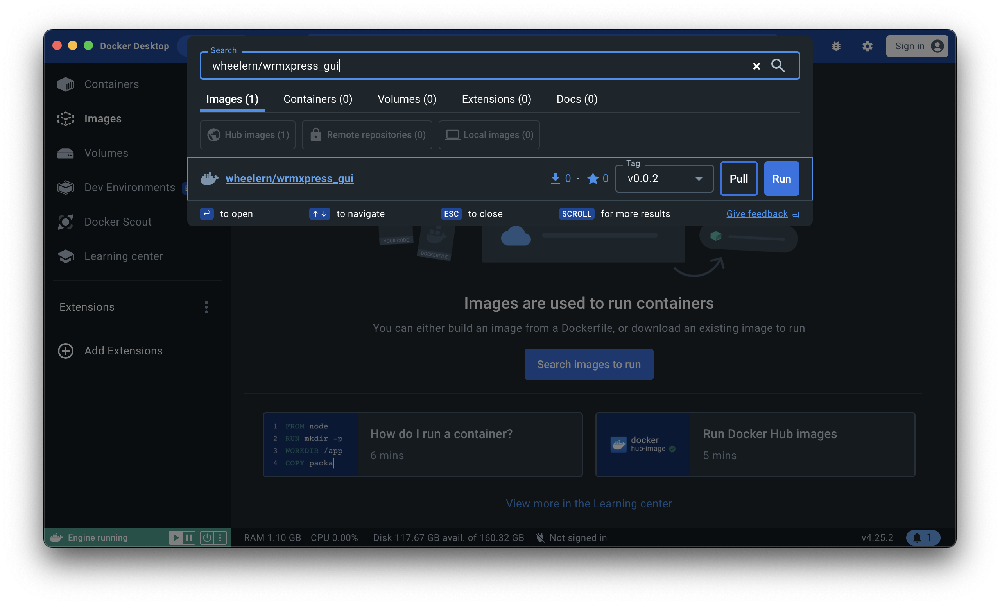
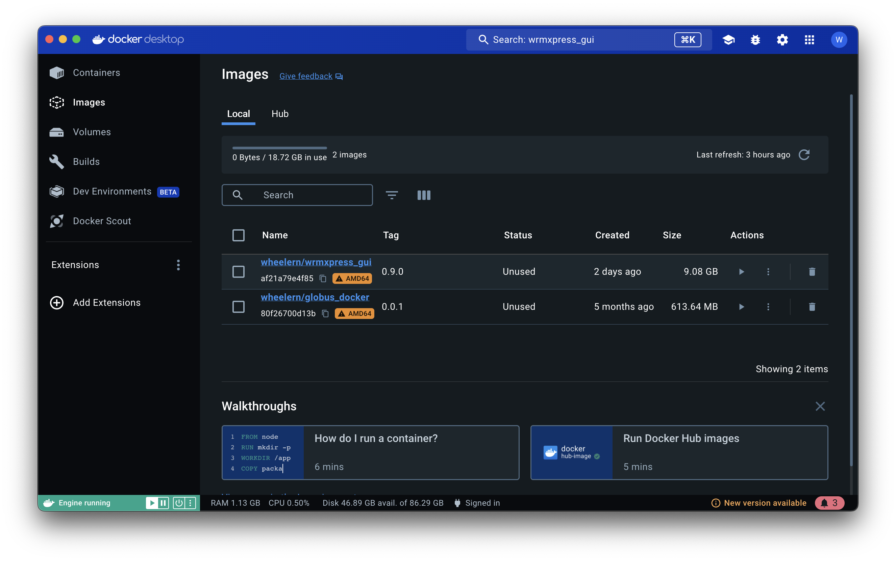
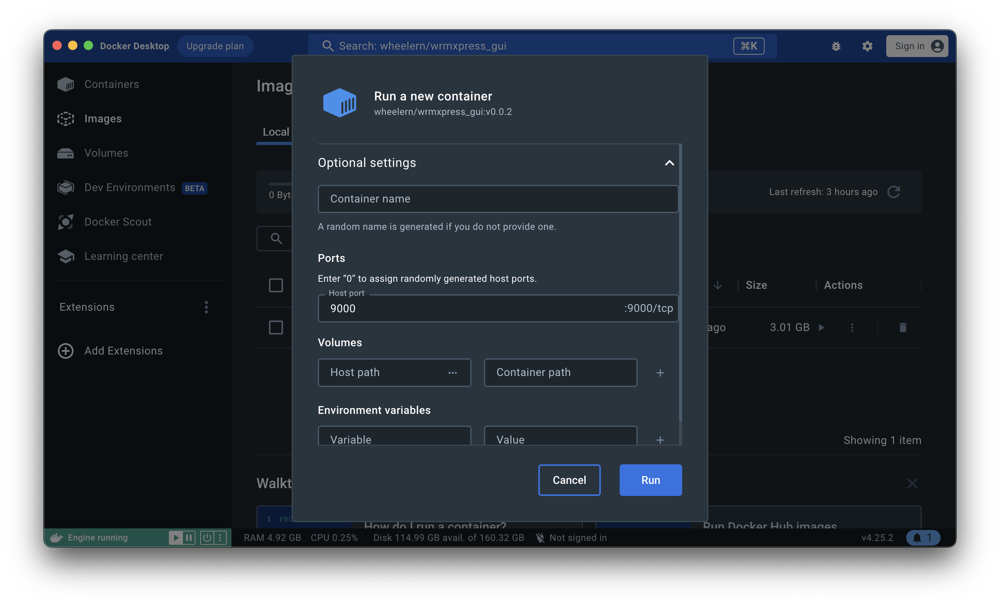
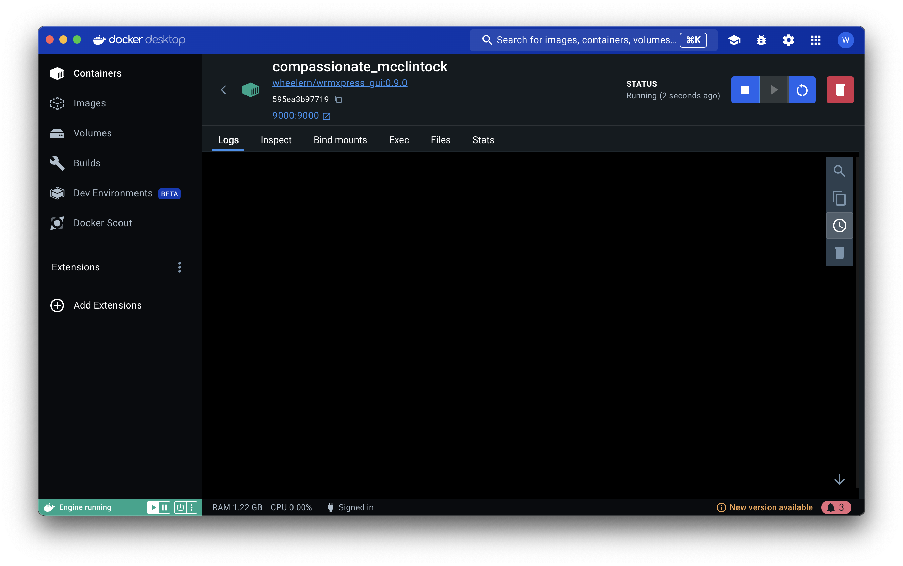
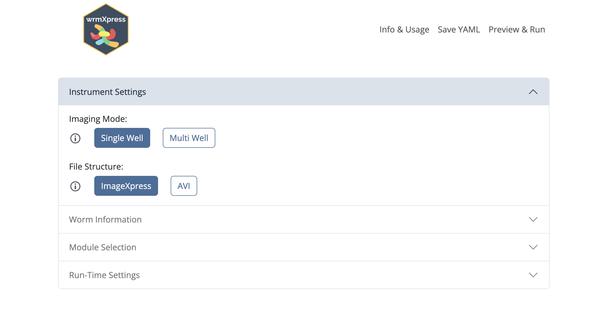
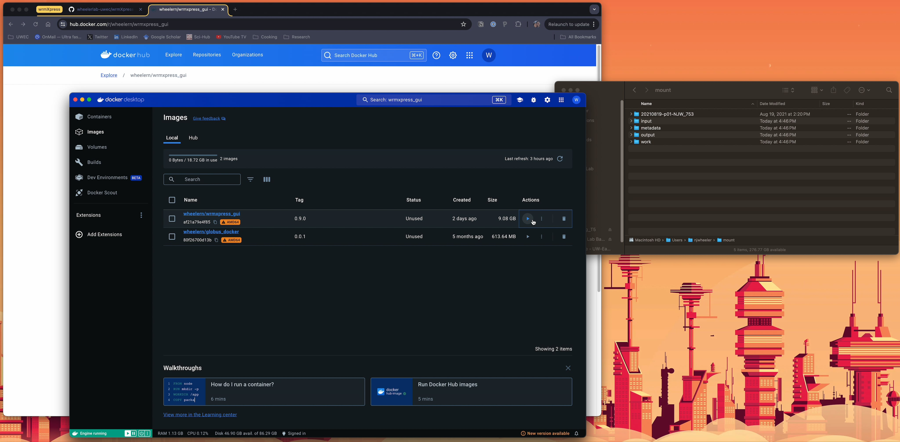
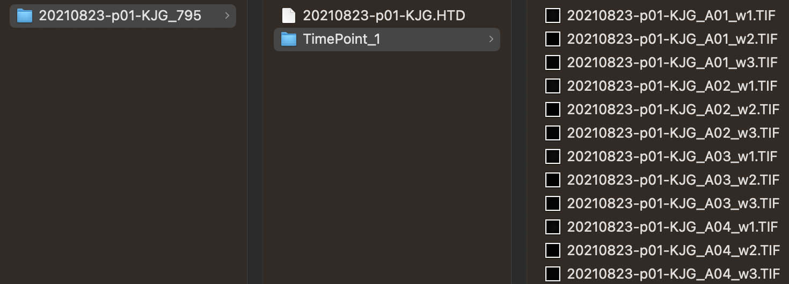
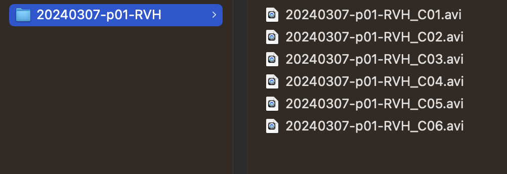

# wrmXpress GUI

A Dash GUI for wrmXpress

## Releases & Builds

<!-- ## Testing

- - -->

## Installation

***Prerequisites*** - Install [Docker Desktop](https://www.docker.com/products/docker-desktop/)

1. Create a working directory that contains all the input images. This folder is where temporary working files/images will be stored, where output data will be written, and will be mounted as a volume in the Docker container.
   + In the example below, this directory is `Users/njwheeler/mount`

2. Start the Docker engine and open up the Dashboard.
3. Use the search bar to find and pull the latest `wheelern/wrmxpress_gui` image from DockerHub:
   + Choose the most recent tag. The compressed image is >9 GB, so it will take a few minutes to pull.

    

4. In the Images pane, click the Run symbol.

    

5. Under Optional settings, make the following changes:
   + Under Ports, set the Host port to 9000
   + Under Volumes, set the Host path to be the path to the working directory created in step #1. Set the Container path to be `/home/`

    

6. Click Run

7. Click the link to 9000:9000 or navigate to `http://localhost:9000` to view the app.

    

8. Follow the guidance in the GUI to prepare and run your analysis.

    

## Video walkthrough

*Will open a new tab*

## Usage instructions

To configure and run analyses, use the navigation column at left-hand side of the screen.

1. **Configure** allows you to select relevant experimental and imaging parameters, as well as select the pipeline that you wish to run. Note that some selections will clash and be disallowed - you should see relevant warnings/errors if so.
2. **Metadata** allows you to include well-based metadata. Each metadata type (i.e., concentration, treatment, time point, etc.) will be saved in a separate CSV with the same numbers of rows/columns selected in Configure.
Custom metadata types can be added. Metadata will be merged with raw output after completing the analysis. Metadata is not required for a pipeline to run. 
3. **Preview** will allow you to preview the ouptput of the pipeline's analysis on well A01. Note that the preview step will fail if well A01 is empty. 
4. **Run** is where the final pipeline will be run on all of the selected wells. Logs are written dynamically to the screen but also to the working directory.

### Data structure

#### TIF files

The ImageXpress by Molecular Devices has an opinionated data structure, and wrmXpress assumes this structure.

Each experiment should include a root directory with the plate name formated as `YYYYMMDD-p##-XYZ` where `p##` is a plate number and `XYZ` are the investigator's initials. The plate name may also include a random integer/index appended in the format `_###`.

Inside of this root plate directory should be separate directories for each time point formated as `TimePoint_#` and starting with `TimePoint_1`. If no additional time points were included in the experiment, then the only folder inside of the root directory should be `TimePoint_1`.

Time point folders will contain the raw images in `.TIF` format. Each image should be named `{plate name}_{well}.TIF`. If there was an index appended to the plate name, this should not be included in the image names. In the case of experiments with multiple
wavelengths per well, `_w#` should be appended after the well ID.

Example of these data structures are shown below:

  
&nbsp; &nbsp; &nbsp; &nbsp;
  

*Note that a `.HTD` files are included in these structure, which is generated by the ImageXpress but not necessary for wrmXpress usage.*

#### AVI files

Some pipelines (i.e., motility, tracking) accept AVI video files instead TIF files within time point folders. In this case, the root plate folder should contain the AVI files in the format `{plate name}_{well}.AVI`, as below:

 

In this case, the AVI file structure needs to be selected in Configure. During analysis, the files may be rearranged to include the time point/TIF structure described above. If so, it is recommended that subsequent analyses should  maintain the reorganized structure and select the ImageXpress file structure.

## Developers

wrmXpress is entirely open-source. The code for the back-end is maintained by the [Zamanian Lab](https://www.zamanianlab.org/) at the University of Wisconsin-Madison and can be found [here](https://github.com/zamanianlab/wrmXpress). The code for the front-end is maintained by the [Wheeler Lab](https://wheelerlab.bio/) at the University of Wisconsin-Eau Claire and can be found in this repository. To receive support for either the GUI or running wrmXpress remotely, please submit a GitHub Issue at the relevent linked repositories.

## Citing wrmXpress

When using the wrmXrpress backend on a remote machine, please cite:

    @ARTICLE{Wheeler2022-ou,
      title    = "{wrmXpress}: A modular package for high-throughput image analysis
                  of parasitic and free-living worms",
      author   = "Wheeler, Nicolas J and Gallo, Kendra J and Rehborg, Elena J G and
                  Ryan, Kaetlyn T and Chan, John D and Zamanian, Mostafa",
      journal  = "PLoS Negl. Trop. Dis.",
      volume   =  16,
      number   =  11,
      pages    = "e0010937",
      month    =  nov,
      year     =  2022,
      language = "en"
    }

When using the GUI, please site the backend (above) as well as this repository:

    @misc{Caterer2024,
      author = {Caterer, Zachary and Horejsi, Rachel and Weber, Carly and Mathisen, Blake and 
      Nelson, Chase and Bagatta, Maggie and Coughlin, Ireland and Wettstein, Megan and 
      Zamanian, Mostafa and Wheeler, Nicolas J.},
      title = {A graphical user interface for wrmXpress democratizes phenotypic screening of 
      parasitic worms},
      year = {2024},
      publisher = {GitHub},
      journal = {GitHub repository},
      howpublished = {\url{https://github.com/wheelerlab-uwec/wrmXpress-gui}},
      release = {v1.0.0}
    }