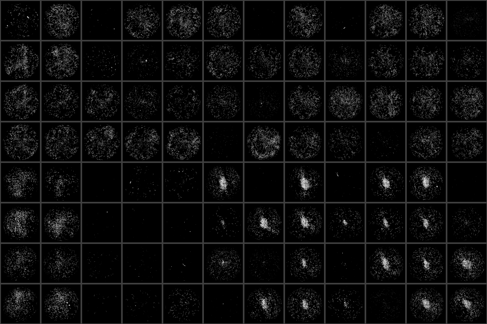

# Run Diagnostics

wrmXpress can generate a variety of diagnostics that allow for evaluation of the analysis. If selected, diagnostics are genereated based on the pipeline selected.

## Static

At minimum, static diagnostics will stitch the first image from each will to generate an overview image of the entire plate. This stitching will also be performed on any of the automatically-generated diagnostic images specific to each pipeline. The rescale multiplier controls if the images are scaled prior to stitching. `rescale_multiplier = 1` will generate a full-resolution image.

### Examples:

/// html | div[style='float: left;width: 50%;']
*Motility*

{: style="width:95%"}
///

/// html | div[style='float: left;width: 50%;']
*Fecundity*

{: style="width:95%"}
///

## Video

If all wells are selected in [Run-Time Settings](run_time.md), video diagnostics will stich all wells together, include all time points, and return the output as an AVI or GIF. If fewer than all wells are selected, no stitching will be performed and instead videos for individual selected wells will be generated. This is useful for multi-timepoint ImageXpress analyses, for which videos are difficult to generate.