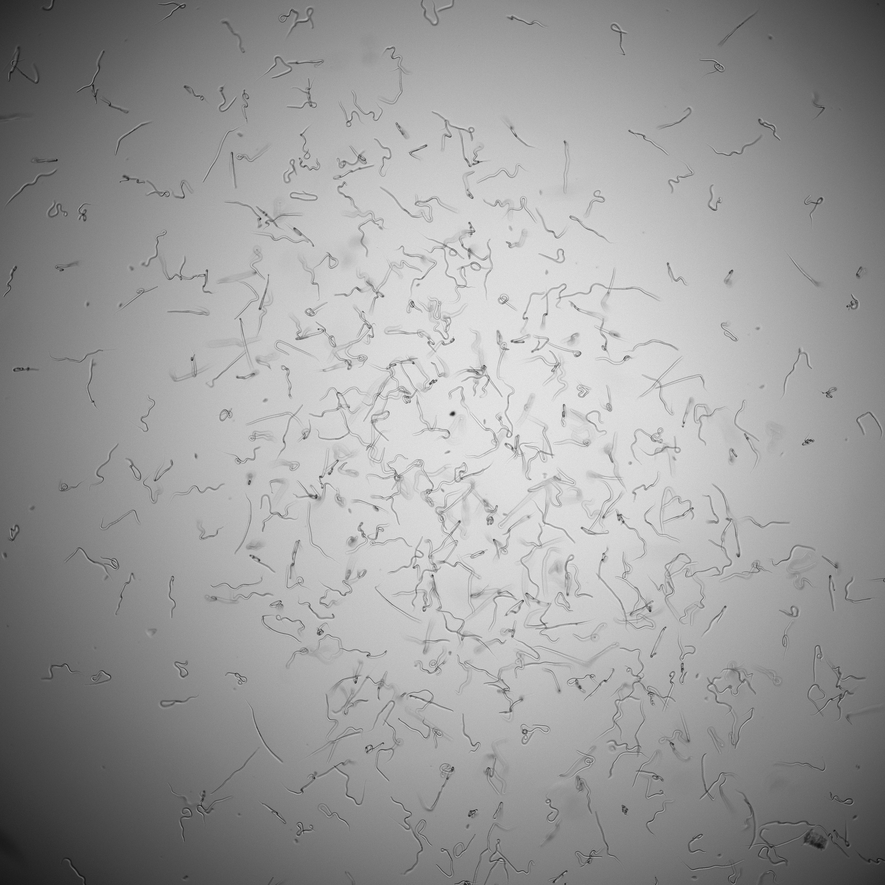
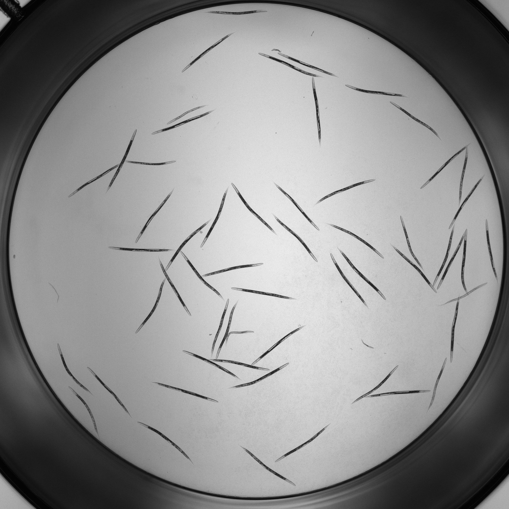
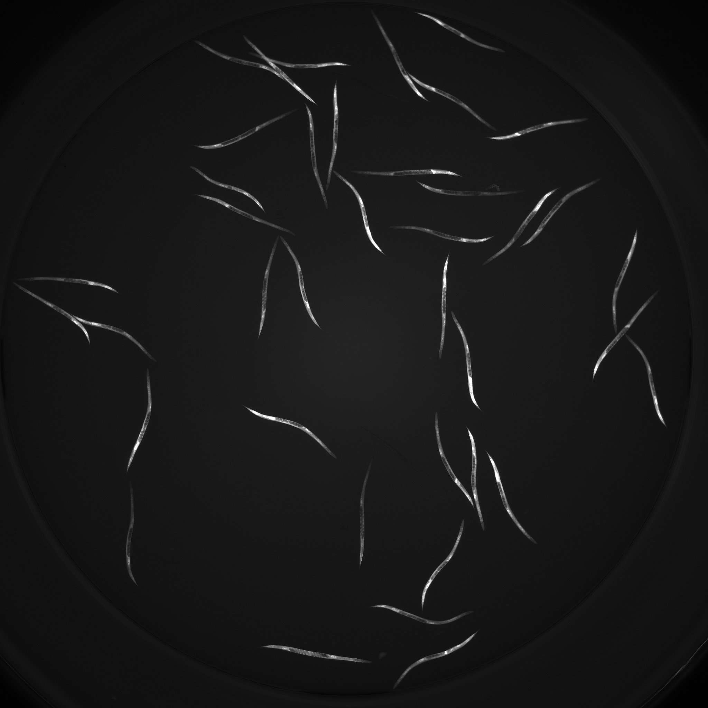
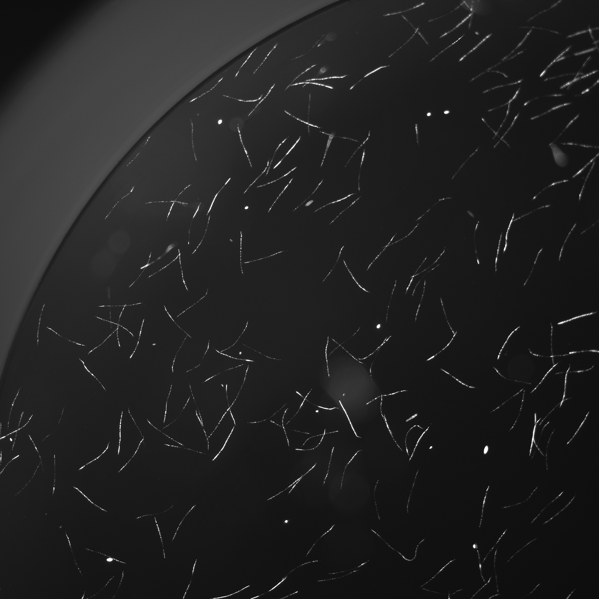
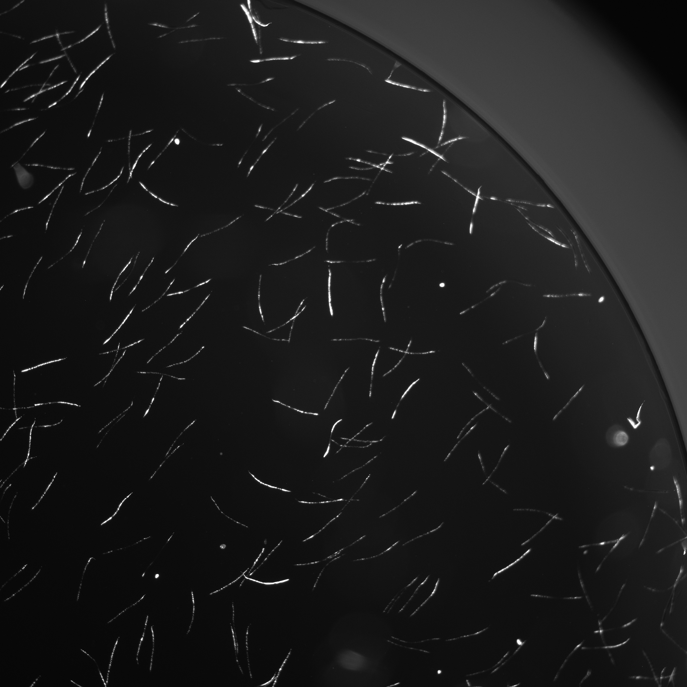
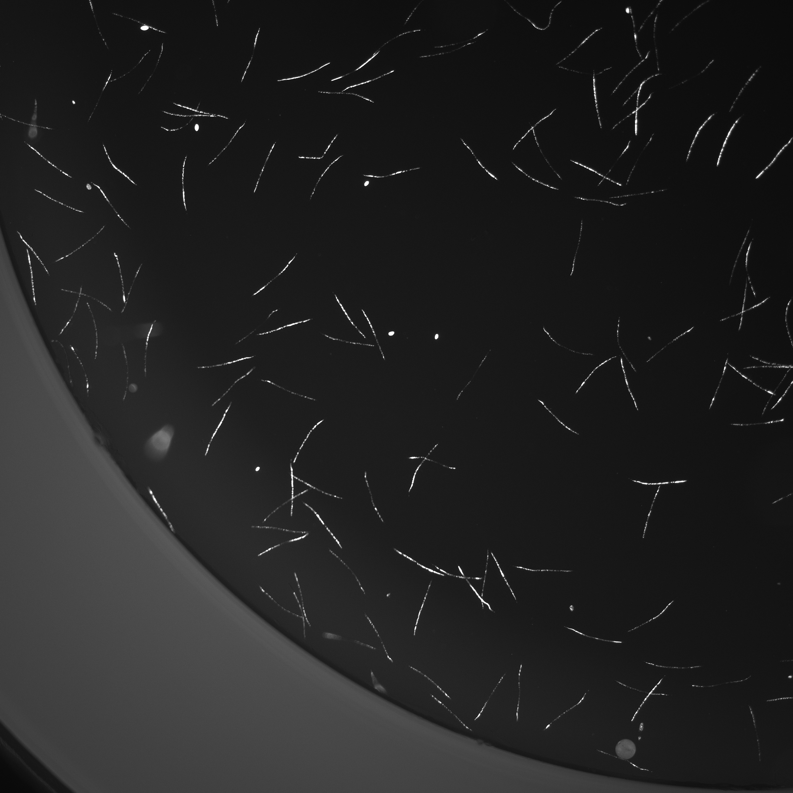
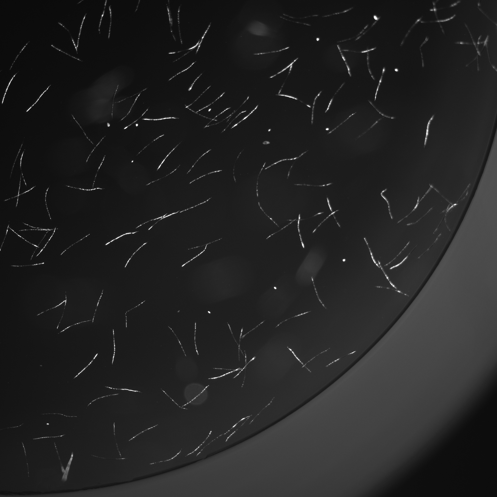
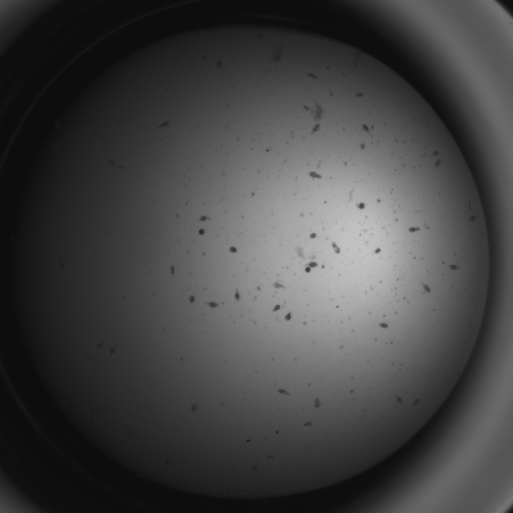
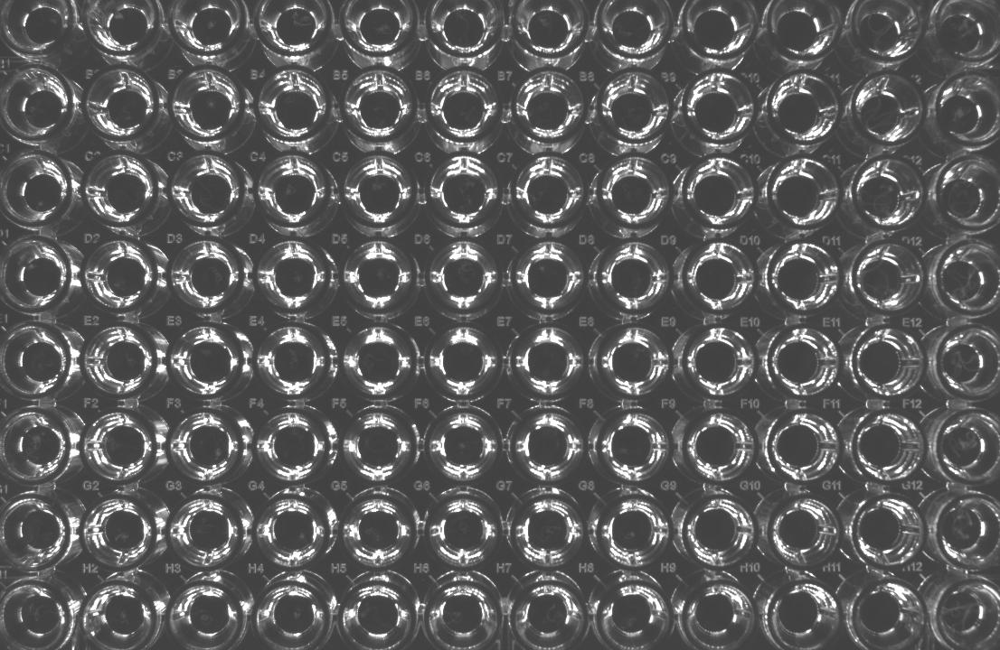
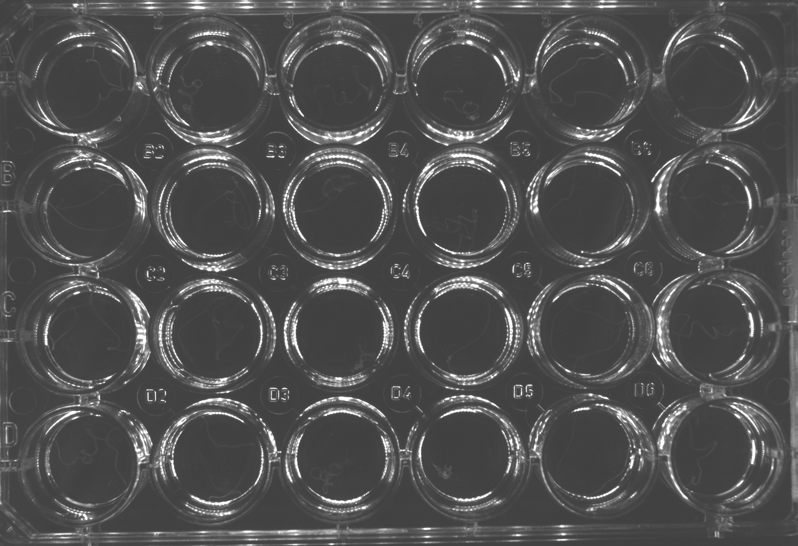

# Instrument Settings

wrmXpress can be used with a variety of data structures. Some pipelines require a particular structure - these requirements can be found in the relevant pipeline documentation. For more information, please see the [data organization documentation](../data_organization.md).

## Potential structures

### ImageXpress + Single Well

- Data is structured as TIFF files in TimePoint folders ([see more](../data_organization.md)).
- Each TIFF image includes a single well.
- Potential naming pattern:
    - `{plate name}_{well}.TIF`
    - `{plate name}_{well}_{wavelength}.TIF`

#### Examples:

/// html | div[style='float: left; width: 33%;']
*96-well plate, 4X*

{: style="width:90%"}
///

/// html | div[style='float: right;width: 66%;']
*96-well plate, 2X, Multi Wavelength*

{: style="width:45%"} {: style="width:45%"}
///

/// html | div[style='clear: both;']
///

### ImageXpress + Multi Well

- Data is structured as TIFF files in TimePoint folders ([see more](../data_organization.md)).
- Each TIFF image includes more than 1 well.
- Input the number of wells in each row/column of the image (integers).

### ImageXpress + Multi Site

- Data is structured as TIFF files in TimePoint folders ([see more](../data_organization.md)).
- Each TIFF image includes a portion of a single well.
- If the pipeline should first stitch the images together, select stitch. If the pipeline should analyze each site independently, leave it unselected.
- Potential naming patterns:
    - `{plate name}_{well}_{site}.TIF`
    - `{plate name}_{well}_{wavelength}_{site}.TIF`
  
#### Examples:

/// html | div[style='float: left;width: 46%;']
*Without stitching*

{: style="width:45%"} {: style="width:45%"}

{: style="width:45%"} {: style="width:45%"}
///

/// html | div[style='float: right; width: 50%;']
*With stitching*

{: style="width:90%"}
///

/// html | div[style='clear: both;']
///

### AVI + Single Well

- Videos are stored in AVI containers ([see more](../data_organization.md)).
- Each AVI video includes a single well.
- Potential naming patterns:
    - `{plate name}_{well}.avi`

#### Examples:

{: style="width:45%"}

### AVI + Multi Well

- Videos are stored in AVI containers ([see more](../data_organization.md)).
- Each AVI video includes more than 1 well (i.e., an entire plate).
- Input the number of wells in each row/column of the video (integers).
- The Grid cropping option will split the video into a grid of `rows` and `columns` based on user input. More cropping options may be developed in the future.
- Potential naming patterns:
    - `{plate name}.avi`

#### Examples:

/// html | div[style='float: left; width: 50%;']
*96-well plate*

{: style="width:90%"}
///

/// html | div[style='float: right;width: 48%;']
*24-well plate*

{: style="width:90%"}
///

/// html | div[style='clear: both;']
///