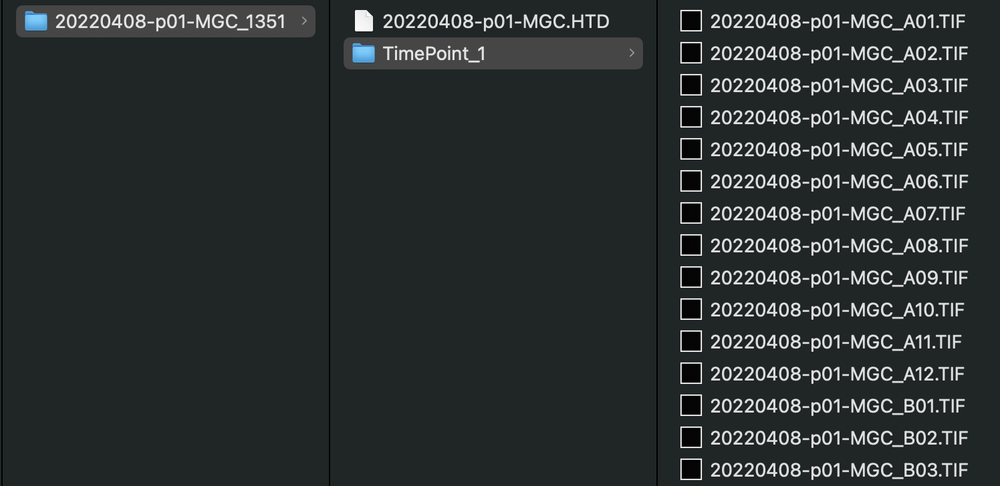

# Development

/// note | Experimental protocol
Detailed procedures for preparing and imaging *Caenorhabditis elegans* phenotypes can be found at the following link: [High-throughput image-based drug screening of *Caenorhabditis elegans* movement, development, and viability (Nature Protocol Exchange)](https://protocolexchange.researchsquare.com/article/pex-2018/v1)
///

## Configuration of the GUI

There are two CellProfiler pipelines that support analysis of development: *C. elegans* size and intensity (Cellpose) and *C. elegans* size. The first pipeline utilizes Cellpose for segementation of worms. The second pipeline uses generic image transformations for segmentation. wrmXpress ships with a Cellpose model that has been trained on thousands of images of drug-treated and untreated *C. elegans* throughout development. Both pipelines utilize a Worm Toolbox model to estimate morphological features from images. The first pipeline performs much better for mixed populations of worms.

/// warning | Custom worm models
Performance of both pipelines will very based on the magnification used to take the images. If you are interested in training your own Cellpose model, please reach out to the [wrmXpress developers](../../index.md#getting-support).
///

In Pipeline Selection, choose CellProfiler and select the pipeline of choice (either *C. elegans* size and intensity (Cellpose) or *C. elegans* size). If using a pipeline that segments worms with a Cellpose model, select the appropriate model in the dropdown.

## Expected input

Development data may be analyzed in the form of individual TIF images per frame (i.e., the TimePoint structure utilized by ImageXpress). See the [Data Organization](../../data_organization.md) page for more details. The plate directory should have a single TimePoint with individual images for each well:

All experiments should include a single wavelength. Multisite images should be stitched according the [ImageXpress + Multi Site instructions](../instrument_settings.md#imagexpress-multi-site).

### Validated species and stages

#### *Caenorhabditis elegans*

- Larvae
- Young adults
- Gravid adults
- Mixed stages

### Example plates

- 20220408-p01-MGC_1351: *Caenorhabditis elegans* mixed stages

## Expected output

A CSV file with at many columns of data generated by with [CellProfiler's](https://cellprofiler.org/) [Worm Toolbox](https://cellprofiler.org/wormtoolbox). If using [Metadata](), there will be an additional column for each provided metadata data frame.
