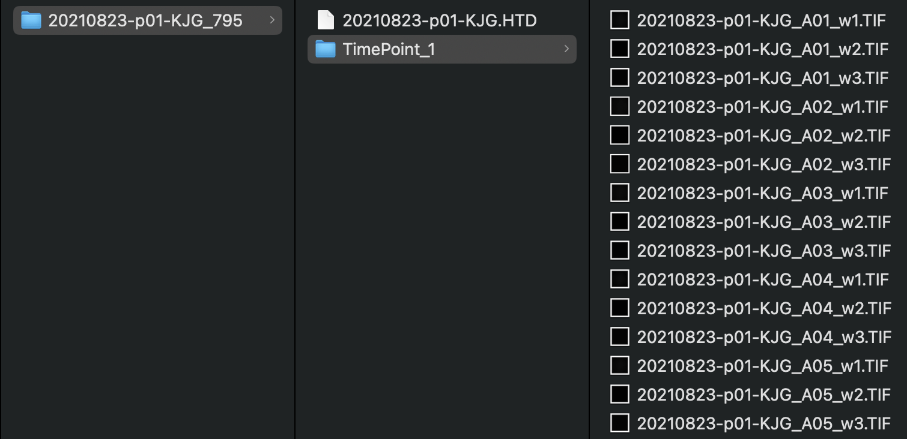

# Feeding

/// note | Experimental protocol
Detailed procedures for preparing and recording images of *Caenorhabditis elegans* phenotypes can be found at the following link: [High-throughput image-based drug screening of *Caenorhabditis elegans* movement, development, and viability](https://protocolexchange.researchsquare.com/article/pex-2018/v1)

///

## Configuration of the GUI

The Feeding analysis is implemented via a CellProfiler pipeline that uses a custom [Worm Toolbox](https://cellprofiler.org/wormtoolbox) model. In Pipeline Selection, choose CellProfiler and select the Feeding pipeline. Additionally, select the appropriate Cellpose model for worm identification.

/// warning | Custom worm models
Performance of the pipeline will very based on the magnification used to take the images. If you are interested in training your own Worm Toolbox model, please reach out to the [wrmXpress developers](../../index.md#getting-support).
///

## Expected input

Feeding data may be analyzed in the form of individual TIF images per frame (i.e., the TimePoint structure utilized by ImageXpress).  See the [Data Organization](../../data_organization.md) page for more details. In the case of individual TIF images per frame, the directory structure should look like this:

All experiments should include three wavelengths and single site.

### Validated species and stages

- *Caenorhabditis elegans* young adults

### Example plates

- 20210823-p01-KJG_795: *Caenorhabditis elegans* young adults

## Expected output

A CSV file with at many columns of data generated by with [CellProfiler's](https://cellprofiler.org/) [Worm Toolbox](https://cellprofiler.org/wormtoolbox). If using [Metadata](), there will be an additional column for each provided metadata data frame.
