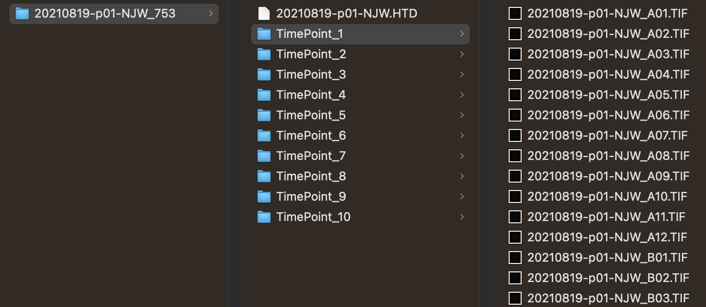
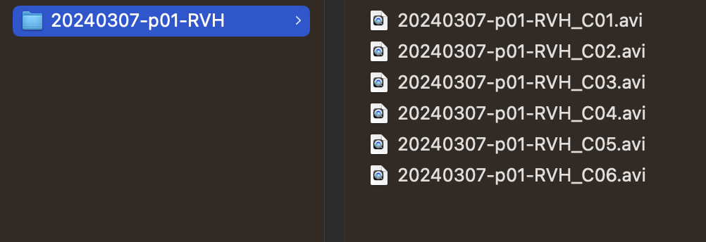

# Motility

/// note | Experimental protocols
Detailed procedures for preparing and recording videos of filarial nematode microfilariae or adults can be found at the following links:

- [Bivariate, high-content screening of *Brugia malayi* microfilariae](https://protocolexchange.researchsquare.com/article/pex-1916/v2)  
- [Multivariate screening of *Brugia* spp. adults](https://protocolexchange.researchsquare.com/article/pex-1918/v2)

///

## Configuration of the GUI

Motility in wrmXpress is measured using Farneback's dense optical flow algorithm implemented by [OpenCV](https://docs.opencv.org/4.6.0/dc/d6b/group__video__track.html#ga5d10ebbd59fe09c5f650289ec0ece5af). This is a departure from other published tools for measuring worm motility, which use the Lucas-Kanade algorithm that focuses on keypoints. 

In Pipeline Selection, choose Optical Flow. Additionally, the OpenCV function includes six parameters that can be adjusted. The following is taken directly from the OpenCV docs:

1. `pyrScale` (Default = 0.5): The image scale (<1) to build pyramids for each image; pyr_scale=0.5 means a classical pyramid, where each next layer is twice smaller than the previous one. Past wrmXpress users have used 0.9 for adult *Brugia* and *Schistosoma* and 0.5 for all other worms.
2. `levels` (Default = 3): The number of pyramid layers including the initial image; levels=1 means that no extra layers are created and only the original images are used. Past wrmXpress users have used 10 for adult *Brugia* and *Schistosoma* and 3 for all other worms.
3. `winsize` (Default = 20): The averaging window size; larger values increase the algorithm robustness to image noise and give more chances for fast motion detection, but yield more blurred motion field. Past wrmXpress users have had success using values between 2 and 30.
4. `iterations` (Default = 7): The number of iterations the algorithm does at each pyramid level. Past users have used 5 and 7.
5. `poly_n` (Default = 5): The size of the pixel neighborhood used to find polynomial expansion in each pixel; larger values mean that the image will be approximated with smoother surfaces, yielding more robust algorithm and more blurred motion field, typically poly_n = 5 or 7.
6. `poly_sigma` (Default = 1.1): The standard deviation of the Gaussian that is used to smooth derivatives used as a basis for the polynomial expansion; for poly_n = 5, you can set poly_sigma = 1.1, for poly_n = 7, a good value would be poly_sigma = 1.5.

## Expected input

Motility data may be analyzed in the form of individual TIF images per frame (i.e., the TimePoint structure utilized by ImageXpress) or in the form of raw, uncompressed AVI video containers. See the [Data Organization](../../data_organization.md) page for more details. In the case of individual TIF images per frame, the directory structure should look like this:

/// caption
In this experiment, the plate directory (`20210819-p01-NJW_753`) has 10 TimePoint directories. TimePoint directories have a single TIF image for each well.
///

In the case of AVIs, the directory structure should look like this:

{: style="width:70%"}
/// caption
In this experiment, the plate directory (`20240307-p01-RVH`) has 6 videos, 1 video for each well.
///

If the AVI includes multiple wells per videos, then the plate directory should include a single AVI with the same plate name.

All experiments should include a single wavelength and single site.

### Validated species and stages

#### Filarial nematodes (i.e., *Brugia malayi* and *Dirofilaria immitis*)

- Microfiliariae
- L3s
- Adults
  
#### Schistosomes

- Adults
- Schistosomula
- Cercaria
- Miracidia (but we recommend using the [Tracking](tracking.md) pipeline instead)
  
#### *Caenorhabditis elegans*

- Larvae
- Young adults
- Gravid adults

### Example plates

- 20210819-p01-NJW_753: *Brugia malayi* microfilariae, 96-well plate, individual wells
- 20220622-p02-KTR: *Brugia pahangi* adults, 96-well plate, whole plate
- 20220527-p02-KTR: *Brugia pahangi* adults, 24-well plate, whole plate

## Expected output

A CSV file with at least three columns: Well, Total Motility, and Worm Area. Variation in the number of worms per well can be corrected for by dividing the motility value by the area value. If using Metadata, there will be an additional column for each provided metadata CSV.