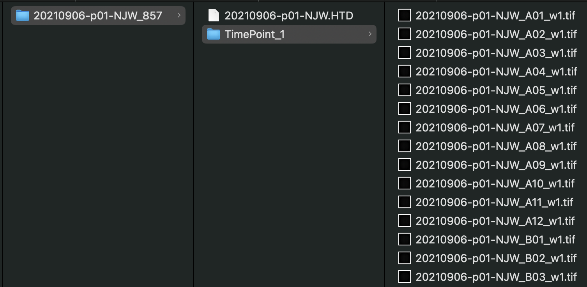

# Segmentation (Fecundity and other use-cases)

The segmentation pipeline provides different tools for segmenting foreground from background. This pipeline has been used for Fecundity experiments, to normalize motility measurement, and for various other use-cases that require estimating the amount of worms in a well. The segmentation pipeline can use a simple Python-based algorithm that finds edges, blurs, and converts to binary or a more complex deep-learning model with Cellpose.

/// note | Experimental protocols
Detailed procedures for preparing and recording images of filarial nematode or schistosome progeny can be found at the following links***

- [Multivariate screening of *Brugia* spp. adults](https://protocolexchange.researchsquare.com/article/pex-1918/v2)
- [wrmXpress: A modular package for high-throughput image analysis of parasitic and free-living worms](https://journals.plos.org/plosntds/article?id=10.1371/journal.pntd.0010937#sec002)
///

## Configuration of the GUI

The following parameters can be adjusted:

1. Segmentation type: Select either Python or Cellpose. If Cellpose, select the appropriate model in the Cellpose model dropdown. If Python, enter the standard deviation to be used for the Gaussian kernel (Python model sigma).
2. Cellpose model: Select the trained Cellpose model to be used for worm identification.
3. Python model sigma: (Default = 2.5): Details found at [the SciPy documentation](https://docs.scipy.org/doc/scipy/reference/generated/scipy.ndimage.gaussian_filter.html). A larger value result in blurier images to segment.
4. Wavelengths (Default = w1): The wavelength to use as input for segmentation.

### Cellpose models

/// warning | Custom worm models
Performance of Cellpose segmentation will vary based on the magnification used to take the images. If you are interested in training your own Cellpose model, please reach out to the [wrmXpress developers](../../index.md#getting-support).
///

wrmXpress currently ships models trained on the following data:

- *Caenorhabditis elegans* (all stages)
- *Caenorhabditis elegans* fluorescent pharynxes
- Microfilariae (performs poorly on pretzel-stage worms and embryos)
- Strongyle-type eggs

## Expected input

Imaging data may be analyzed in the form of individual TIF images per frame (i.e., the TimePoint structure utilized by ImageXpress) or in the form of raw, uncompressed AVI video containers. See the [Data Organization](../../data_organization.md) page for more details.  All experiments should include a single wavelength. Multisite images should be stitched according the [ImageXpress + Multi Site instructions](../instrument_settings.md#imagexpress-multi-site).

If running a fecundity experiment, the plate directory should have a single TimePoint with individual images for each well:

Each well should include all the progeny from a single parent.

### Validated species and stages

- Filarial nematodes (i.e., *Brugia malayi* and *Dirofilaria immitis*)
- Schistosomes
- Strongyle-type eggs

### Example plates

- 20220722-p04-JDC_1606: *Schistosoma mansoni* with adults and eggs in the well
- 20220722-p06-JDC_1608: *Schistosoma mansoni* without adults and eggs in the well
- 20210906-p01-NJW_857: *Brugia pahangi*

## Expected output

A CSV file with at least two columns: Well and Segmented Area. Variation in the number of worms per well can be corrected for by diving the motility value by the area value. If using [Metadata](), there will be an additional column for each provided metadata data frame.
