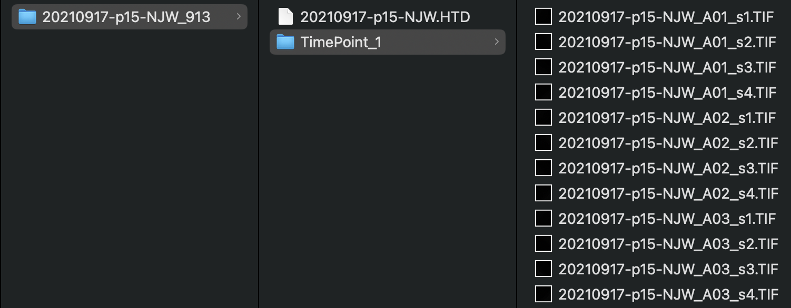

# Toxicity

/// note | Experimental protocol
Detailed procedures for preparing and recording images of filarial nematode microfilariae (mf) can be found at the following link: [Bivariate, high-content screening of *Brugia malayi* microfilariae](https://protocolexchange.researchsquare.com/article/pex-1916/v2)

///

## Configuration of the GUI

Toxicity can be analyzed using the generic segmentation methods directed to the proper Wavelength (if using a fluorescent indicator). In Pipeline Selection, choose Segmentation. The following parameters can be adjusted:

1. `model_type`: Select either Python or Cellpose. If Cellpose, select the appropriate model in the `cellpose_model` dropdown. If Python, enter the standard deviation to be used for the Gaussian kernel (`sigma`).
2. `cellpose_model`: Select the trained Cellpose model to be used for worm identification. For toxicity, models are provided for microfilaria or *C. elegans* identification.
3. `sigma` (Default = 2.5): Details found at [the SciPy documentation](https://docs.scipy.org/doc/scipy/reference/generated/scipy.ndimage.gaussian_filter.html). A larger value result in blurier images to segment.
4. `wavelengths` (Default = 'All): The wavelength(s) to use as input for segmentation.

## Expected input

Toxicity data should be analyzed in the form of individual TIF images per frame (i.e., the TimePoint structure utilized by ImageXpress). See the [Data Organization](../../data_organization.md) page for more details. The plate directory should have a single TimePoint with individual images for each well:

All experiments should include a single wavelength. Multisite images should be stitched according the [ImageXpress + Multi Site instructions](../instrument_settings.md#imagexpress-multi-site). The above screenshot shows the structure of unstitched input images that include the `_s[1|2|3|4].TIF` structure.

### Validated species and stages

#### Filarial nematodes (i.e., *Brugia malayi* and *Dirofilaria immitis*)

- Microfiliariae
- L3s
- Adults (with varying success)

#### *Caenorhabditis elegans*

- Larvae
- Young adults
- Gravid adults

### Example plates

- 20210917-p15-NJW_913: *Brugia malayi* microfilariae

## Expected output

A CSV file with at least # columns: . If using [Metadata](), there will be an additional column for each provided metadata data frame.
