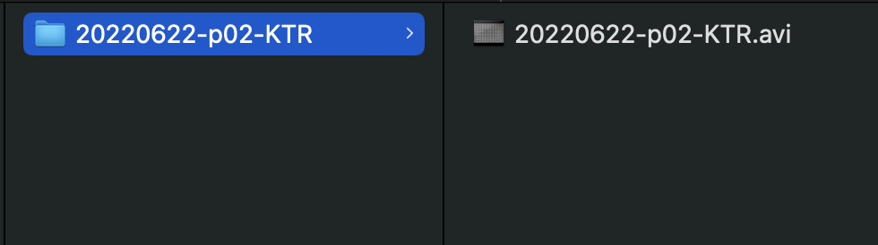

# Data organization

The ImageXpress by Molecular Devices has an opinionated data structure, and wrmXpress assumes this structure.

Each experiment should include a root directory with the plate name formated as `YYYYMMDD-p##-XYZ` where `p##` is a plate number and `XYZ` are the investigator's initials. The plate name may also include a random integer/index appended in the format `_###`.

Inside a plate folder, there are two options for organizing the images, either as an individual TIF image for each well stored in a directory of each time point (total number of images = # time points x # wells x # wavelengths) or as a single AVI video for each well (total number of videos = # wells).

## TIF files (ImageXpress default)

Compatible with the following pipelines:

- [Motility](configuration/pipelines/motility.md)
- [Fecundity](configuration/pipelines/fecundity.md)
- [Toxicity](configuration/pipelines/toxicity.md)
- [Feeding](configuration/pipelines/feeding.md)
- [Development](configuration/pipelines/development.md)
- [Tracking](configuration/pipelines/tracking.md)

Detailed data structure expectactions for each pipeline can be found in the relevant pipeline documentation.

Inside of the plate directory should be separate directories for each time point formatted as `TimePoint_#` and starting with `TimePoint_1`. If no additional time points were included in the experiment, then the only folder inside of the root directory will be `TimePoint_1`.

Time point folders will contain the raw images in `.TIF` format. Each image should be named `{plate name}_{well}.TIF` or `{plate name}_{well}_{wavelength}_{site}.TIF` for multiwavelength, multisite experiments. If there was an index appended to the plate name, this should not be included in the image names.

Example of these data structures are shown below:

{: style="width:75%"}

{: style="width:75%"}

/// note | HTD files
`.HTD` files are shown in the above images. This file is automatically generated by the ImageXpress but not necessary for wrmXpress usage.
///

## AVI files

Compatible with the following pipelines:

- [Motility](configuration/pipelines/motility.md)
- [Tracking](configuration/pipelines/tracking.md)

### Single AVI per well

Some pipelines accept AVI video files instead TIF files within time point folders. The root plate folder should contain the AVI files in the format `{plate name}_{well}.AVI`, as below:

{: style="width:75%"}

In this case, the AVI file structure needs to be selected in Configure - [Instrument Settings](configuration/instrument_settings.md). During analysis, the files may be rearranged to include the time point/TIF structure described above. If so, it is recommended that subsequent analyses should  maintain the reorganized structure and adjust the configuration selections accordingly.

### Single AVI per plate

Alternatively, an AVI file of an entire plate can be provided, and wrmXpress can crop wells and analyze them individually. In this case, the roote plate folder should contain a single AVI file in the format `{plate name}.AVI`, as below:

{: style="width:75%"}

In this case, the file structure should be set to AVI and the imaging mode should be set to Multi Well in Configure - [Instrument Settings](configuration/instrument_settings.md). In plate format, include the number of columns and the wells in the plate. The plate will then be cropped in accordance with these settings. After cropping, the files will be rearranged to include the time point/TIF structure described above.