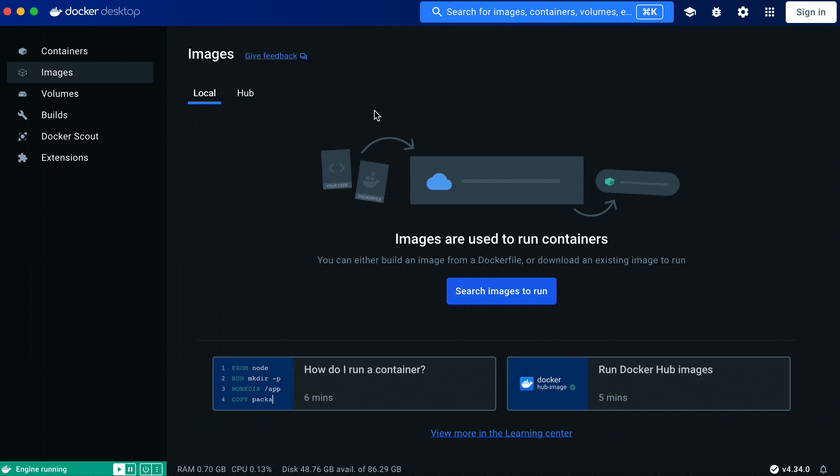
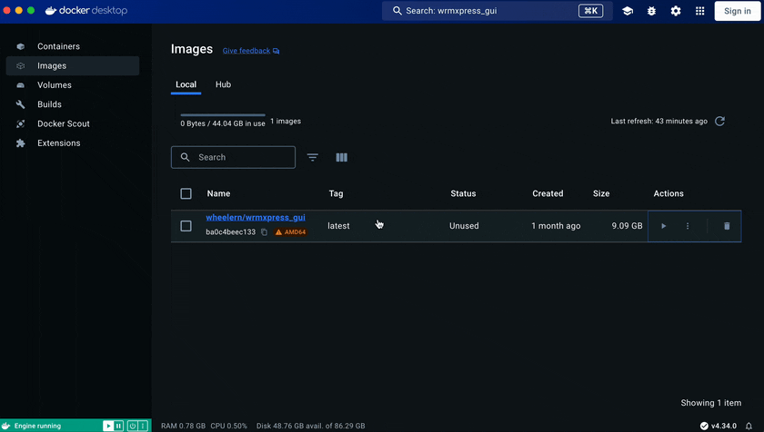
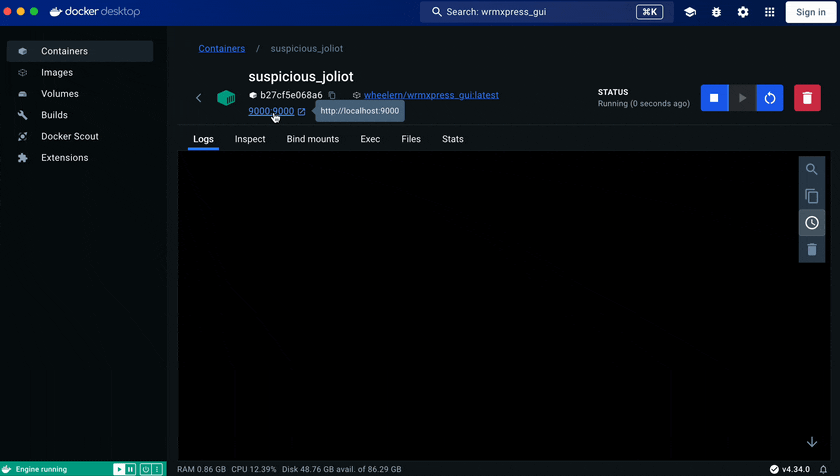

# wrmXpress GUI

wrmXpress is a suite of tools to analyze images and videos of free-living and parasitic flatworms and nematodes. It is designed to work out-of-the-box with data generated with a Molecular Devices ImageXpress high-content imager, but will work with any image type that is organized in an idiosyncratic manner (described in [Data Organization](data_organization.md)). Analytical pipelines featured in wrmXpress include:

- [Motility](configuration/pipelines/motility.md)
- [Fecundity](configuration/pipelines/fecundity.md)
- [Toxicity](configuration/pipelines/toxicity.md)
- [Feeding](configuration/pipelines/feeding.md)
- [Development](configuration/pipelines/development.md)
- [Tracking](configuration/pipelines/tracking.md)

Some pipelines require specific experimental procedures to generate the proper data (i.e., the Feeding pipline requires images of worms that have been fed fluorescent dyes), while other pipelines are generalizable across multiple worm species, stages, and imaging environments. Detailed documentation for each pipeline can be found at the corresponding links above.

## Usage

For large high-throughput analyses, wrmXpress can be run using a command-line interface and is deployable to high-throughput or high-performance remote computer clusters. If running small to medium sized analyses (i.e., 96 wells or less), wrmXpress can also be run using a graphical-user interface (GUI) on any computer operating system (Windows, MacOS, Linux) with Docker Desktop. This documentation is oriented toward users of the GUI and includes screenshots and videos of GUI configuration and usage.

### Installation of the GUI

/// note | Prerequisites
Before starting, download and install [Docker Desktop](https://www.docker.com/products/docker-desktop/)
///

The GUI is deployed via Docker Desktop and is run in any modern browser (i.e., Chrome, Firefox, Safari, etc.). Installation through Docker Desktop is simple and allows for pain-free updates when desired.

1. Create a working directory on your computer that contains all the input images. This folder is where temporary working files/images will be stored, is where output data will be written, and will be mounted as a volume in the Docker container.
   - In the example below, this directory is `Users/njwheeler/mount`

2. Open Docker Desktop.
3. Use the search bar to find and download ("pull") the latest `wheelern/wrmxpress_gui` image from DockerHub:
   - Choose the most recent tag. The compressed image is >9 GB, so it will take a few minutes to download.

    {: style="width:100%"}

4. After downloading, in the Images pane of Docker Desktop, click the Run symbol.
5. Under Optional settings, make the following changes:
   - Under Ports, set the Host port to 9000
   - Under Volumes, set the Host path to be the path to the working directory created in step #1. Set the Container path to be `/home/`
6. Click Run
   - Click OK if a warning pops up.
  
    {: style="width:100%"}

7. Once running, click the link to 9000:9000 or navigate to `http://localhost:9000` to view the app.

    {: style="width:100%"}

    /// warning | Be patient
    It may take 15-30 seconds for the GUI to start. Refresh the page if the GUI is not showing up in your browser.
    ///

8. Follow the guidance in below to configure and run your analysis.

## Quick start

To configure and run analyses, use the navigation column at left-hand side of the GUI. Full documentation for the Configure, Metadata, Preview, and Run steps can be found in the corresponding sections of this documentation site.

1. **Configure** allows you to select relevant experimental and imaging parameters, as well as select the pipeline that you wish to run. Note that some selections will clash and be disallowed - you should see relevant warnings/errors if so.
2. **Metadata** allows you to include well-based metadata. Each metadata type (i.e., concentration, treatment, time point, etc.) will be saved in a separate CSV with the same numbers of rows/columns selected in Configure - [Run-Time Settings](configuration/runtime.md).
Custom metadata types can be added. Metadata will be merged with raw output after completing the analysis. Metadata is not required for a pipeline to run.
3. **Preview** will allow you to preview the output of the pipeline's analysis on well A01 (or on the first well selected).
4. **Run** is where the final pipeline will be run on all of the selected wells. Logs are written dynamically to the screen but also to the working directory.

### Video walkthrough

<iframe src="https://player.vimeo.com/video/986779390?badge=0&amp;autopause=0&amp;player_id=0&amp;app_id=58479" frameborder="0" allow="autoplay; fullscreen; picture-in-picture; clipboard-write" style="position:absolute;top:0;left:0;width:100%;height:100%;" title="wrmXpress GUI Walkthrough"></iframe>

## Developers

wrmXpress is entirely open-source. The code for the back-end is maintained by the [Zamanian Lab](https://www.zamanianlab.org/) at the University of Wisconsin-Madison and can be found [here](https://github.com/zamanianlab/wrmXpress). The code for the front-end is maintained by the [Wheeler Lab](https://wheelerlab.bio/) at the University of Wisconsin-Eau Claire and can be found [here](https://github.com/wheelerlab-uwec/wrmXpress-gui).

## Getting support

To receive support for either the GUI or running wrmXpress remotely, please submit a GitHub Issue at the relevant linked repositories:

- [wrmXpress back-end](https://github.com/zamanianlab/wrmXpress)
- [wrmXpress GUI](https://github.com/wheelerlab-uwec/wrmXpress-gui)

## Citing wrmXpress

When using the wrmXrpress back-end on a remote machine, please cite:

    @ARTICLE{Wheeler2022-ou,
      title    = "{wrmXpress}: A modular package for high-throughput image analysis
                  of parasitic and free-living worms",
      author   = "Wheeler, Nicolas J and Gallo, Kendra J and Rehborg, Elena J G and
                  Ryan, Kaetlyn T and Chan, John D and Zamanian, Mostafa",
      journal  = "PLoS Negl. Trop. Dis.",
      volume   =  16,
      number   =  11,
      pages    = "e0010937",
      month    =  nov,
      year     =  2022,
      language = "en"
    }

When using the GUI, please site the back-end (above) as well as the GUI's GitHub repository:

    @software{Caterer2024,
      author = {Caterer, Zachary and Horejsi, Rachel and Weber, Carly and Mathisen, Blake and 
      Nelson, Chase and Bagatta, Maggie and Coughlin, Ireland and Wettstein, Megan and 
      Zamanian, Mostafa and Wheeler, Nicolas J.},
      title = {A graphical user interface for wrmXpress democratizes phenotypic screening of 
      parasitic worms},
      date = {2024-07-18},
      url = {https://github.com/wheelerlab-uwec/wrmXpress-gui},
      version = {v1.0.0}
    }
