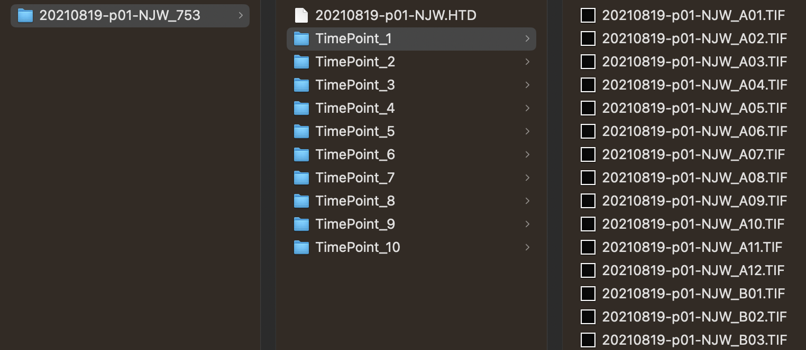

# Motility

***Detailed experimental protocols for preparing and recording videos of filarial nematode microfilariae (mf) or adults can be found at the following links***

- [Protocol for *Brugia malayi* microfilariae](https://protocolexchange.researchsquare.com/article/pex-1916/v2)
- [Protocol for *Brugia malayi* adults](https://protocolexchange.researchsquare.com/article/pex-1918/v2)

## Expected input

Motility data may be analyzed in the form of individual TIF images per frame (i.e., the TimePoint structure utilized by ImageXpress) or in the form of raw, uncompressed AVI video containers. [See the data organization page for more details.](../data_organization.md). In the case of individual TIF images per frame, the directory structure should look like this:

In this experiment, the plate directory (`20210819-p01-NJW_753`) has 10 TimePoint directories. TimePoint directories have a single TIF image for each well.

In the case of AVIs, the directory structure should look like this:

In this experiment, the plate directory (`20240307-p01-RVH`) has 6 videos, 1 video for each well.

All experiments should include a single wavelength and single site.

### Validated species and stages

#### Filarial nematodes (i.e., *Brugia malayi* and *Dirofilaria immitis*)

- Microfiliariae
- L3s
- Adults
  
#### Schistosomes

- Adults
- Schistosomula
- Cercaria
- Miracidia (but we recommend using the [Tracking](tracking.md) pipeline instead)
  
#### *Caenorhabditis elegans*

- Larvae
- Young adults
- Gravid adults

### Example plates

- 20210819-p01-NJW_753: *Brugia malayi* microfilariae, 96-well plate, individual wells
- 20220622-p02-KTR: *Brugia pahangi* adults, 96-well plate, whole plate
- 20220527-p02-KTR: *Brugia pahangi* adults, 24-well plate, whole plate

## Expected output

A CSV file with at least three columns: Well, Total Motility, and Worm Area. Variation in the number of worms per well can be corrected for by diving the motility value by the area value. If using [Metadata](), there will be an additional column for each provided metadata data frame.

## Configuration of the GUI