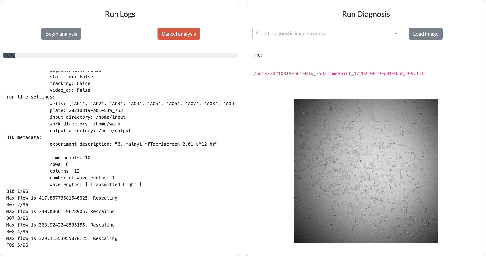

# Run

After Configuration, adding [Metadata](metadata.md), and [Previewing](preview.md) the analysis, you are now read to Run a full analysis.

After clicking "Begin Analysis", images will be copied from `{working_directory}` to `{working_directory/input/}`. Depending on the size of these input data, there may be a short delay before the pipeline(s) begin running. Once started, the Run Logs pane will dynamically update with a progress bar, and Run Diagnosis will show one time point of the well currently being analyzed:

After run completion, stitched diagnostic images of the entire plate will be shown:

